## About
Last Updated *[07/17/2019]*   
Created by [OSU Maps and Spatial Data](https://info.library.okstate.edu/map-room)

## Table of Contents
- Introduction 
- *[Story Map Journal]*
- - Getting Started
- - Creating the Journal
- - Settings
- - Finishing Up
- Conclusion
- Further Reading/Resources

## Introduction
Story Maps are a relatively new and unique way of telling stories by using maps, images and videos. Esri offers many different Story Map templates that can be utilized for a multitude of projects and purposes.

## *[Story Map Cascade]*
Story Map Cascade allows you to create and in-depth journal narrative which is organized into sections. This allows readers to scroll through these different sections of text and see the relavent content, such as maps, images, videos, etc. 

#### Getting Started
1. In order to locate the older story map templates, visit this [website](https://storymaps-classic.arcgis.com/en/app-list/?buildApp=true).
2. Locate the Story Map Journal and select **Build**.

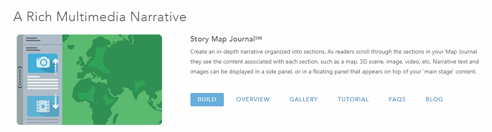

3. A new window will open and you will be able to choose between a **Side Panel** or a **Floating Panel**. You can view live examples of both and choose the one you desire. For this guide, we will be using **Side Panel**. Click **Start**.

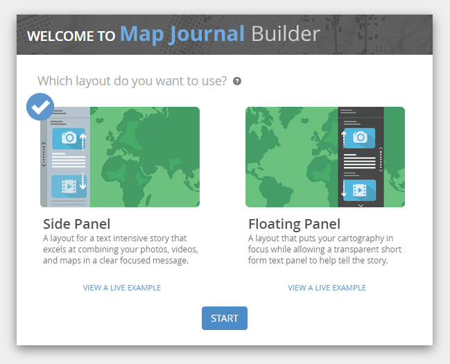

#### Creating the Journal
1. Enter a title for your Map Journal and click the **blue arrow**.

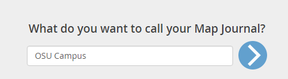

2. Format the Home Section. The first step is choosing what you want the cover page to be. We will be using an image, but you can use any of the **Content** options. When you have added the desired content, click **Next**.

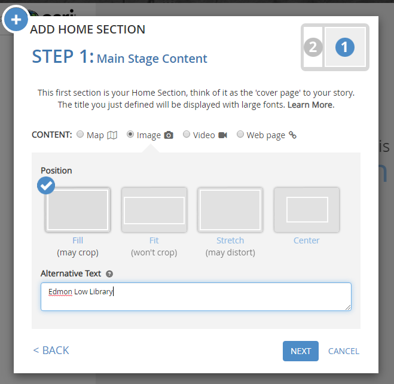

3. Add the desired content in the Side Panel section and click **Add**.

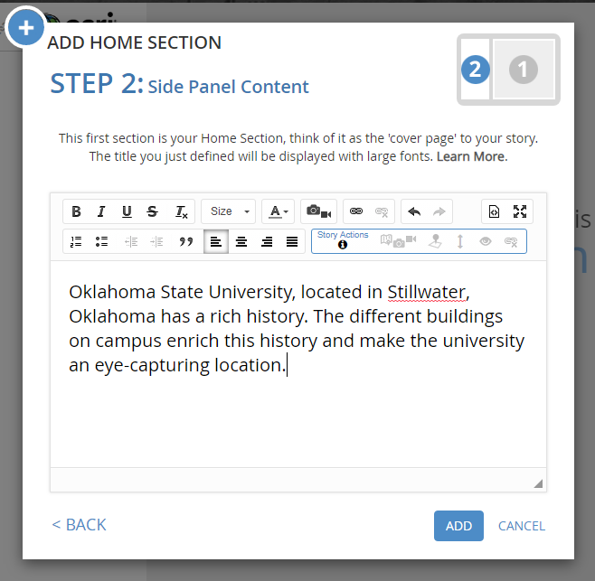

4. If you wish to change the section, click on the blue circle with a the pencil icon. 

5. Update everything as desired and click **Save**.

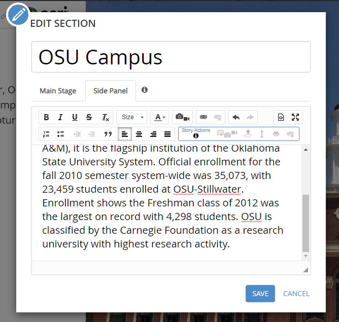

6. To add a section click **Add Section** at the bottom of the side panel.

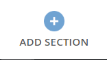

7. Repeat steps 2-3 for each section you wish to add. 

8. To reorganize the sections that have already been created, click **Organize**, drag and drop the sections where you would like them and click **Apply**.

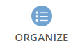

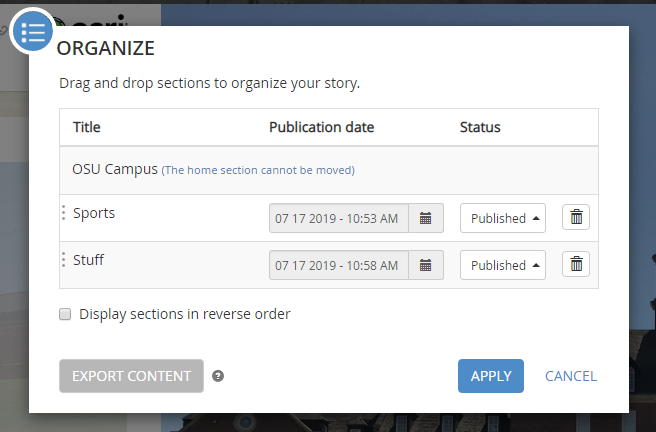

#### Settings
1. To further alter the appearance of the Story Map Journal, click **Settings**.

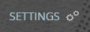

2. Under the *Layout* tab, you can change the type of panel.

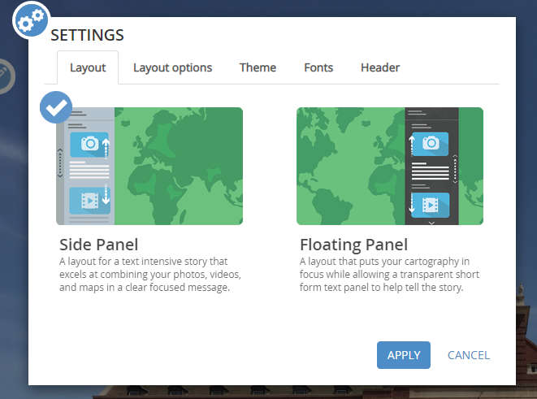

3. Under *Layout options*, you can change where the side panel is positioned and how wide it is.

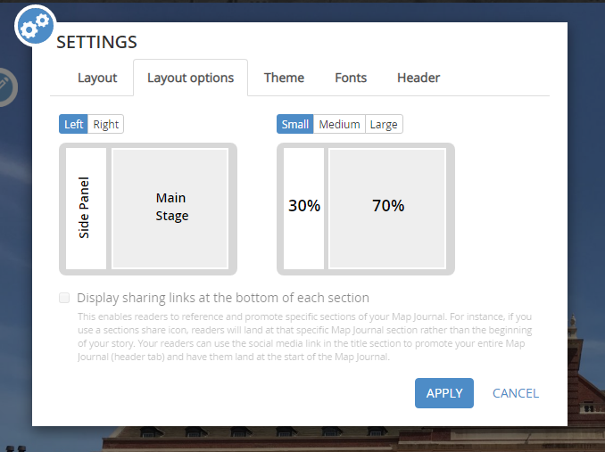

4. *Theme* lets you choose from a variety of color schemes.

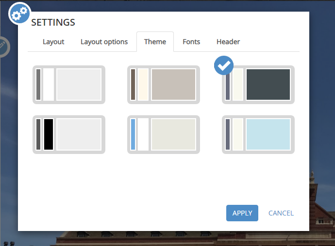

5. *Font* allows you to change the fonts.

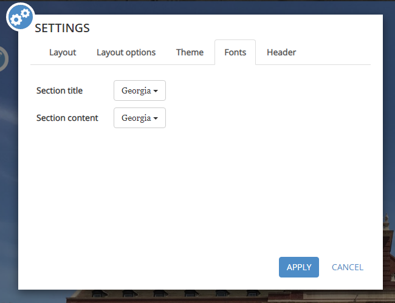

6. Finally, *Header* lets you change things found in the header, such as the logo, link, and tagline.

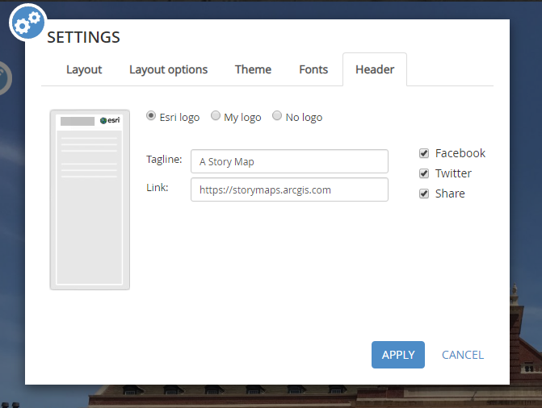

7. When you are finished, click **Apply**.

#### Finishing Up
1. Be sure to save your project often. Click **Save** in the upper right hand corner of the screen.

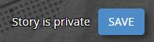

2. To check out the story as a reader before sharing it, click **View Story**. This opens a new tab where you can explore the story.

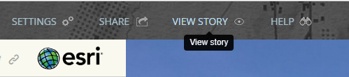

3. Finally, to share the story, click **Share**.

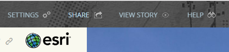

4. Choose how you would like to share the story and click **CLOSE**.

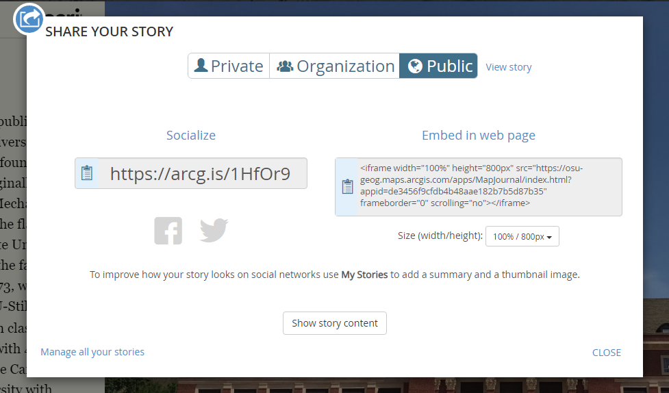

## Conclusion
Story Map Journal is a great choice for when a lot of narrative is need and there are accompanying media files or maps to add more detail and make it more interesting.

## Further Reading/Resources

[Return to Top](#about)
